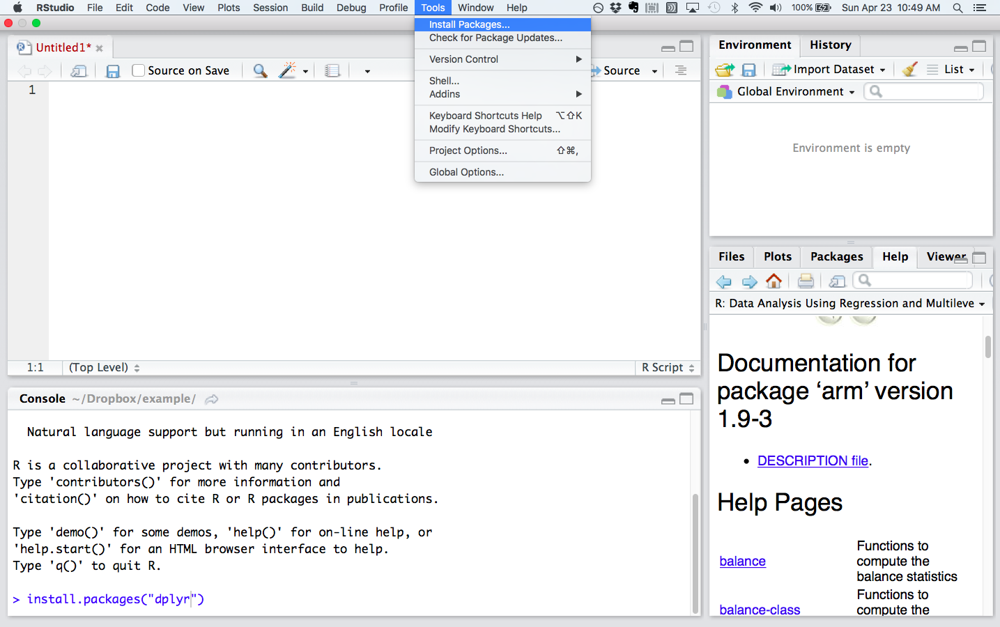
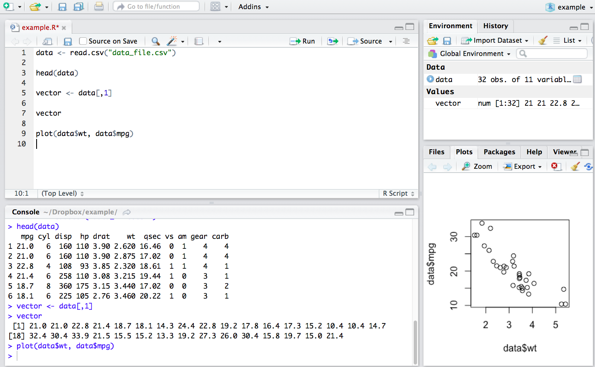

# Getting started


This chapter offers a basic orientation to the main tools we'll be using in the course, R and RStudio.

## R and RStudio

Download and install [R](https://cran.r-project.org) and [RStudio](www.rstudio.com). Make sure to get the desktop version of RStudio.  Note:  you must have R installed before you install RStudio.   

- [Directions for installing R on Windows](http://youtu.be/Ohnk9hcxf9M)
- [Directions for installing R on a Mac](https://youtu.be/uxuuWXU-7UQ)
- [Directions for installing RStudio on a Mac](https://youtu.be/bM7Sfz-LADM)
- Here is a detailed introduction to RStudio:   [DataCamp:  RStudio, part 1](https://www.datacamp.com/courses/working-with-the-rstudio-ide-part-1)


## Packages

Once you've got RStudio installed on your machine, download and install the following packages, which we'll be using frequently in the course:

- dplyr (for data manipulation)
- ggplot2 (for plotting using the "grammar of graphics")
- tidyverse (which includes the above two packages and many more)
- caret (for machine learning)
- arm (miscellaneous functions for "applied regression modelling")
- knitr (for compiling R Markdown documents)

To install these packages, look for "Tools" in RStudio and select "Install packages" from the dropdown menu. Browse for the package you want to install. You can accomplish the same thing by typing, for example, `install.packages("dplyr")` in the console, the area in RStudio where you enter R programming commands directly.  By default the console pane is in RStudio's lower left quadrant.



When you install R, a large number of functions are automatically included.  We'll refer to these functions as "base R."  While you can perform just about any programming task in base R, the above packages include already-written and (helpfully) -debugged  functions that allow you to focus on statistics rather than programming.

Note that the "Package" tab in RStudio's plot pane (by default in the lower right quadrant) lists the packages you have installed; clicking on the highlighted package name will bring up in the "Help" tab a list of the functions included in the package.  The documentation for each function has crucial details about usage and output, along with examples.  Sometimes the documentation also helpfully includes links to papers, or "vignettes," that provide additional details on the package.

In order to use a package, remember that you must load it.  After starting a new R session, load a package--for example, dplyr--by typing  `library(dplyr)` or `require(dplyr)`.

## Super basic orientation to RStudio

I've already mentioned the plot pane and the console pane.  Here are more details on the spatial organization of RStudio.

### Environment pane (upper right quadrant)

R is an object-oriented programming language.  This means that we assign data, values or functions to objects which we then can manipulate.  For example, we can load a .csv file from the working file directory into R's memory with the following command:  `data <- read.csv("data_file.csv")`.  This command assigns the `data_file.csv` table to an object called `data` which is now available for immediate use.




The environment tab in the environment pane in the upper right quadrant shows the objects in R's working memory:

- **Data frames** or other multi-dimensional data structures listed under "Data."  Here we can see that `data` is a table with 32 observations of 11 variables. 

- **Vectors** or atomic values under "Values."  Here we took the first column of `data` to create a vector of values stored in the object `vector`.

- **Functions** (none stored in the above example).

Thus, at a glance, we can see the objects that are available for use.

The environment pane also has a History tab that stores all the commands that have been run during an R session.  This can be useful if you want to look back at what you did during a session and perhaps recover a code snippet that you failed to save.

### Plot pane (lower right quadrant)

The plot pane consists of 5 tabs, the most important of which are:  

- Files: shows the files in your working directory.

- Plots: displays graphical output.  Here we have created a scatterplot of car `mpg` against `wt`.

- Packages: lists the installed packages. 

- Help: contains detailed information about packages and functions.

### Console pane (lower left quadrant)

This is the command line.  You can type R code directly here, then press "return" to run it. Or, code  contained in a source file--for example, from a script file (.R) or a markdown file (.Rmd)--can be selected and run in the console using "control-enter." Output from such code is printed directly to the console.  In the above example, the script contains the command `head(data)`; when this is run `head(data)` appears in the console along with the output--the first 6 rows of `data`.  

In the console, you can scroll up to see previous output, but there are practical limitations to what you can retrieve this way since code and output typically piles up during a session.   The better way to save your work is to write a script or markdown file in the source pane. (As mentioned above the History tab in the Histor` pane will save all the commands run during a session.) 

### Source pane (upper left quadrant)

The document in the above example is entitled `example.R`.  .R documents are script files that are, essentially, just text files.  These can be shared through email, for example, and the recipient can then open and run them in a local R session.  Script files are a fantastic way to work interactively---running the code in the script, observing the output, and then adjusting the code as necessary.  Save the script to save your work:  the script will enable you  to exactly reproduce your output in a future session. 

To open a .R or .Rmd file select "File" from the toolbar and then "New File."  Pick the desired document type from the drop down menu.

It is good practice to add comments to script files so that your future self, or a collaborator, knows what you were up to.  Lines that begin with  hashtag, `#`, will be ignored by R:

```{r}
# Download data
data <- read.csv("data_file.csv") # document titles must be in quotes

# Inspect the first 6 rows
head(data)

# Create scatter plot of mpg ~ wt
plot(data$wt, data$mpg)

# Not surprisingly, there is a strong negative correlation!
# As weight goes up, gas mileage goes down.
```


