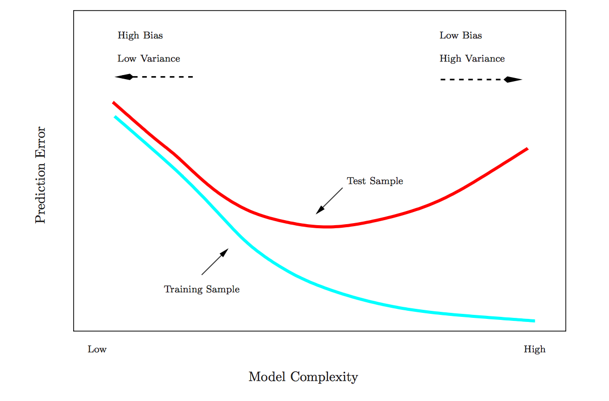
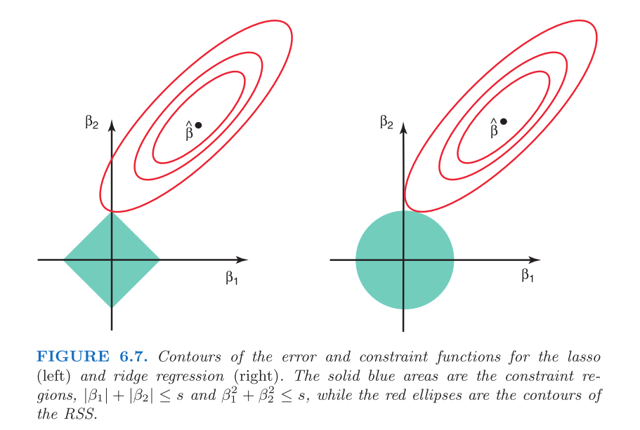

# Model Fitting

```{r include=FALSE}
knitr::opts_chunk$set(cache=T, warning=FALSE, message=FALSE)
library(arm)
library(ggplot2)
library(tidyr)
library(dplyr)
library(ISLR); data(Hitters)


rss <- function(fitted, actual){
  sum((fitted - actual)^2)
}

rmse <- function(fitted, actual){
  sqrt(mean((fitted - actual)^2))
}

R2 <- function(fitted, actual){
  tss <- sum((actual - mean(actual))^2)
  rss <- sum((actual - fitted)^2)
  1 - rss/tss
}

display(h <- lm(Salary ~ Hits, data= Hitters))

rss(fitted(h), na.omit(Hitters$Salary))
rmse(fitted(h), na.omit(Hitters$Salary))
R2(fitted(h), na.omit(Hitters$Salary))
```

This chapter covers a range of additional topics related to model fitting, such as variable selection, model comparison, cross-validation and missing data imputation.  It culminates with a discussion of ridge and LASSO regression, two useful regression-based machine learning techniques for automatically selecting variables in high dimensional data so as to balance the bias-variance trade-off. The concepts and methods discussed here apply to both linear and logistic regression. 

Additional resource:

- [Introduction to Statistical Learning](http://www-bcf.usc.edu/~gareth/ISL/index.html).  See chapters 5 and 6. 

## General rules for variable selection 

How do we know which variables belong in a model?  The short answer is:  we often don't.  Here are some rules of thumb when thinking about variable selection:^[For further discussion, see Gelman chapter 4, page 69.]

- *Think about the data*.  What variables does it make sense to include given the situation?  Does any published literature offer guidance? If we are in descriptive mode then we may only care about certain variables and use the others as controls.  If we are in predictive mode then we include all variables that, for substantive reasons, might be important in predicting the outcome.  This is very general guidance, however, as different contexts demand different approaches to model fitting.

- *Include quadratic terms if there is evidence from bivariate plots of a non-linear relationship between predictor and outcome.*  In general, we don't include polynomial terms with degrees greater than 2. To do so risks overfitting.

- *Look for possible interactions  among variables with the largest main effects.*  In general we don't include higher order interactions (greater than 2) unless we have a sensible rationale and can explain it (to ourselves and to our audience). 2 way interactions are hard enough to explain.

- *Consider combining separate predictors into a single predictor---a "total score"---by summing or averaging them.*

- *Keep it simple.* Parsimonious models are almost always better---they are more interpretable and tend to have lower variance.


## Stepwise variable selection

The traditional technique in statistics for selecting variables is *stepwise selection*.

With *forward selection* we start with a null model (intercept only) and add one variable at a time. If the added variable improves the model, then we keep it in and add another.  We continu until all variables have been tested.

With *backward selection* we start with a full model (all available terms), and serially remove variables.  If the model is better after a variable has been removed, then we leave it out.  We continue until all variables have been tested.

*Forward selection followed by backward selection*. Select forward then backward.

Unfortunately these hand-fitting procedures are flawed. They depend on the order in which variables are added or excluded and often will not select the best model.  Furthermore, in the Boston data there are $k$ = 13 predictor variables, which means there are $2^k$ or `r 2^13` possible models we could fit, not even including interactions or polynomial terms. This is an extremely large space to search through to find the best model, and the search is computationally expensive and time consuming. Conducting such a search manually would be impossible.  


## Comparing models

We are already familiar with $R^2$, RMSE and RSS as tools for comparing models.  In general, if we add a variable and $R^2$ goes up and RMSE/RSS goes down, then the model with the additional variable is better. The amount of unexplained variance has decreased.  However, there is a danger of overfitting. As we've seen, adjusted $R^2$ penalizes the fit for the number of predictors. Likewise, information criterion methods like AIC (Akaike Information Criterion) penalize the fit for model complexity, defined as the number of predictors. 

$$\mathrm{AIC} = - 2\ln(L) + 2k$$
where $k$ the number of estimated parameters in the model, $L$ is the maximized value of the likelihood function for the model, and $ln$ is the natural log. Given a set of candidate models for the data, the preferred model is the one with the lowest AIC value.  In penalizing for larger $k$ (ensured by the final term, $+2k$), AIC attempts to guard against overfitting. It is possible, then, to see $R^2$ go up with the addition of predictors, while AIC goes down.  

We can also compare models with a formal statistic test using the likelihood ratio test (LRT):  
$$
2 \times [ \ln(L_{a}) - \ln(L_{c}) ]
$$
where $\ln(L_{c})$ is the log likelihood of the current model and $\ln(L_{a})$ is the log likelihood of the alternative model with additional predictors. The `lrtest()` function in the lmtest package implements the LRT.  The `anova()` function in base R will also compare models using an f-test, with results that will be virtually identical to the LRT.

Here are some examples of model comparison using the Hitters data from the ISLR package. We start with a null model of Salary:

```{r}
library(ISLR); data(Hitters)
display(null <- lm(Salary ~ 1, data = Hitters))
round(mean(Hitters$Salary, na.rm = T),2)
```

A null model consists only in an intercept, the coefficient of which, as we can see, is just the mean of Salary.  (Note that in order to calculate the mean of Salary we needed to remove the missing values. `lm()` silently removes the missing values: `display()` reports $n = 263$, whereas the dataset has 322 rows.) The key question as we make a model more complex is whether that complexity is justified, whether adding predictors not only lowers the bias but does so without unduly increasing the potential variance. Let's add predictors.

```{r}
library(lmtest)
display(h1 <- lm(Salary ~ Hits, data = Hitters))
lrtest(null, h1)
anova(null, h1)
as.matrix(AIC(null, h1))
```

Hits is statistically significant, since the 95% CI does not include 0 (4.39 $\pm$ 2 x .56).  These three methods agree that the model with Hits is an improvement over the null model.  In the case of `lrtest()` and `anova()` the p-value represents the results of a statistical test (chi-squared test and f-test, respectively) for whether the second, more complex model is a better fit to the data.  Does adding an additional predictor, AtBat, improve the model further?

```{r}
display(h2 <- lm(Salary ~ Hits + AtBat, data = Hitters))
lrtest(h1, h2)
anova(h1, h2)
as.matrix(AIC(h1, h2))
```

The results are ambiguous.  R-squared goes up, while AIC, log likelihood and RSS go down, but the decline in the latter two cases is not statistically significant.  (This result is consistent with the fact that AtBat is not itself statistically significant, since the 95% CI for AtBat includes 0: -1.22 $pm$ 2 x .64.) Should we leave AtBat in the model? It doesn't improve the fit much, if at all, while adding complexity.  So, we should take it out.  Unfortunately such choices are often not clear, which is why model fitting sometimes seems more like an art than a science.

To implement forward selection, we would keep adding variables and comparing models using `lrtest()` or `anova()` trying to find the best possible fit.  One problem with this procedure, however, is that the order in which we step through predictors will impact our selection decisions because each predictor's impact on model fit is contingent on  the presence of the others. For example, suppose we had added AtBat later in the selection process:

```{r}
h3 <- lm(Salary ~ Hits + Years + HmRun + RBI + Walks + Assists, data = Hitters)

h4 <- lm(Salary ~ Hits + Years + HmRun + RBI + Walks + Assists + AtBat, data = Hitters)

lrtest(h3, h4)
as.matrix(AIC(h3, h4))
```

Now AtBat clearly improves the fit, but we would never have discovered that had we already thrown it out.  This is troubling.  Is there a better way?  Perhaps.

## Automatic variable selection

Algorithms have been developed to search model space efficiently for the optimal model. A caution about automatic variable selection is in order at the outset, however.  *Choosing variables should not be a mechanical process.*  We should, instead, seek to understand the data generating process.  Indeed, the greatest benefit of manual stepwise selection consists less in producing a good model than in the understanding gained by fitting many models, and seeing, through trial and error, which predictors are most reactive with the outcome. Especially when it comes to description, automatic variable selection algorithms are just tools for exploring your data and thinking about models. 

The `step()` function in base R automates stepwise variable selection using AIC.

```{r}

display(step(lm(Salary ~ ., data = Hitters), trace = F, direction = "forward"))

```
Forward selection settled on 19 predictors with model $R^2$ of .55.


```{r}

display(step(lm(Salary ~ ., data = Hitters), trace = F, direction = "backward"))

```

Backward selection settled on 10 predictors with $R^2$ of .54.  (The default setting in `step()` for direction is "both," which returns the same result as the above.)  This function certainly simplifies stepwise variable selection, but even the automated stepwise algorithm is not guaranteed to return the optimal model, as the result still depends on the sequence in which variables are entered into the model.  Moreover, the fact that backward selection returned such a different model is concerning.  Ideally, we do not want our model to depend on a methodological choice---we just want the best model.  And in this case, while the larger model has a marginally higher $R^2$, it is also much more complicated:  does the better fit justify the additional complication?  Probably not.  With the bigger model we have likely crossed the line into overfitting, an issue we will take up when we discuss cross-validation.

The `regsubsets()` function in the leaps package performs exhaustive search of the model space using the leaps algorithm for variable selection.

```{r}
library(leaps)

plot(regsubsets(Salary ~ ., data = Hitters, method = "exhaustive", nbest = 1))


```

The plot presents multiple candidate models organized by BIC on the y-axis.  Like AIC, BIC penalizes for model complexity.^[$\mathrm{BIC} = {\ln(n)k - 2\ln({L})},$ where $L$ is the maximum likelihood value, $n$ is the number of observations, $k$ is the number of parameters, and $ln$ is the natural log.]  Lower BIC is better.  The model with the lowest BIC is the rather simple one at the top of the plot:  Intercept, AtBat, Hits, Walks, CRBI, DivisionW and PutOuts.  If we refit a model with these predictors using `lm()` we find it has an $R^2$ of .51.  

<!-- ```{r} -->
<!-- display(lm(Salary ~ AtBat + Hits + Walks + CRBI + Division + PutOuts, data = Hitters)) -->
<!-- ``` -->

Is this model really better?  The algorithm did an exhaustive search of the model space yet returned a model with lower $R^2$!  How could that be better?  But it probably is better.   While the bias in this model will be higher than in the larger model selected by the `step()` function, the variance is likely lower.  Remember:  bias refers to in-sample model performance and variance refers to the out-of-sample model performance---how the model does when it encounters new data.  If the model performs poorly on new data, with a big discrepancy between  in-sample and out-of-sample performance, then it is overfitting.  AIC, BIC, and adjusted R-squared all penalize for model complexity in order to avoid overfitting and will tend to select models with higher bias and lower variance.

## Cross validation 

Cross validation (CV) is the technique we use to assess whether a model is overfitting and to estimate how it will perform on new data.  

Overfitting is a major hazard in predictive analytics, especially when using machine learning algorithms like random forest which, without proper tuning, can learn sample data almost perfectly, essentially fitting noise.  When such a model is used to predict new data, with different noise, model performance can be shockingly bad.  We use CV to help us identify and avoid such situations.  How so?  Many machine learning algorithms require the user to specify certain parameters.  In the case of random forest, for example, we need to specify values for $m$, the number of randomly chosen predictors to be used at each tree split.  The lower the $m$, the simpler the tree. We can use CV to choose the value of $m$ that  minimizes variance and reduces overfitting.  Linear regression has no user-specified parameters, but CV still helps us assess how much a model might be overfitting the sample data.  

The simplest version of CV is the so-called validation set method, consisting in the following steps:


1. *Split the sample data into two parts: a train set and a test set.*  Researchers use different proportions, but it is common to randomly select 70% of the data as the train set and 30% as the test or validation set.  (Obviously, we must have enough data in the sample to fit a model after splitting the data.)  Because CV relies on random sampling, our results will vary unless we use `set.seed()`. We will demonstrate using the Hitters data, using only complete cases.


```{r}
set.seed(123)
Hitters_complete <- Hitters[complete.cases(Hitters), ]
rows <- sample(nrow(Hitters_complete), .7 * nrow(Hitters_complete))
train <- Hitters_complete[rows, ]
test <- Hitters_complete[-rows, ]
```

2.  *Fit a model on the training set* using an appropriate variable selection procedure. We will create two models for comparison:  one with all the variables, then one with just the variables chosen by `regsubsets()`.

```{r}
full_model <- lm(Salary ~., data = train)

select_model <- lm(Salary ~ AtBat + Hits + Walks + CRBI + Division + PutOuts, data = train)
```

3.  *Use that model to predict on the testing set.*  Performance on the test set is the CV estimate for the model's out-of-sample performance. 


```{r}
results <- data.frame(Model = c("Full model in-sample",
                                "Select model in-sample",
                                "Full model out-of-sample",
                                "Select model out-of-sample"),
                      RMSE = round(c(rmse(fitted(full_model), train$Salary),
                               rmse(fitted(select_model), train$Salary),
                               rmse(predict(full_model, newdata = test), test$Salary), 
                               rmse(predict(select_model, newdata = test), test$Salary)),1))

results
```
We can see that the full model is overfitting---in-sample RMSE is worse than out-of-sample RMSE---while the select model chosen by `regsubsets()` using BIC is not overfitting.  In fact, the select model actually does better out-of-sample than in-sample, though this particular result is likely a matter of chance, a function of random split we happen to be using. Generally, though, these results illustrate the danger of model complexity, and why it makes sense to choose predictors using measures of model fit that penalize for complexity.  Simple models tend to generalize better.  This figure depicts these relationships:



As model complexity increases, the in-sample fit will likely keep getting better and better.  But the out-of-sample fit starts getting worse at a certain threshold of complexity, as the model begins fitting noise in the sample.  CV is designed to identify that threshold.

## $K$-fold and bootstrap cross validation

The above CV procedure is standard in prediction contests.  The famous million dollar Netflix prize, for example, was won by the team whose model achieved the lowest error on the test set. And the competitions hosted at [Kaggle](kaggle.com) likewise involve a training/testing format in which competitors train models on a train data set and then use their models to make predictions on a test set. 

The problem with this  train-test CV procedure is that results can be quite variable due to the single random split defining the two sets.  $K$-fold CV is designed to solve this problem.  From *Statistical Learning*:

> This approach involves randomly dividing the set of observations into $k$ groups, or folds, of approximately equal size. The first fold is treated as a validation set, and the method is fit on the remaining $k − 1$ folds. The mean squared error, $MSE_1$,is then computed on the observations in the held-out fold. This procedure is repeated $k$ times; each time, a different group of observations is treated as a validation set. This process results in $k$ estimates of the test error, $MSE_1,MSE_2,...,MSE_k$. The $k-fold$ CV estimate is computed by averaging these values:  $CV_k = \sum_{i=1}^{k}MSE_i.$(181)

There are different types of CV, many of which are available in the caret package (details [here](http://appliedpredictivemodeling.com/blog/2014/11/27/vpuig01pqbklmi72b8lcl3ij5hj2qm)).  By default caret  uses  25 bootstrap samples^[Bootstrap samples, remember, are samples of size $n$ with replacement.] rather than folds.  Some data points will be left out of each bootstrap sample; caret uses those as the test set for estimating out-of-sample predictive error.

```{r}
library(caret)
set.seed(123)
train(Salary ~ ., 
      data = train, 
      method = "lm")
```

The output that caret prints to the screen is *not* in-sample RMSE and $R^2$ but is rather the CV estimate of out-of-sample error.  Estimated out-of-sample RMSE for the full model is 391.19.  Let's compare this result to the one for the select model.

```{r}
set.seed(123)
train(Salary ~ AtBat + Hits + Walks + CRBI + Division + PutOuts, 
      data = train, 
      method = "lm")
```

Estimated out-of-sample RMSE for the select model is 362.17, which roughly agrees with the result we obtained using the validation set method:  the simpler model has lower variance.  And why do we care about lower variance?  Because models that perform better on new data are less yoked to the idiosyncrasies of sample data and presumably doing a better job of describing the characteristics of the population.  Such models are better at both inference and prediction.

## Description vs. prediction

Let's use caret's functionality to fit different sorts of models---a random forest model and a gradient boosted model---to see how the CV estimated out-of-sample error compares to the select linear model of Salary.  Both of these algorithms automatically select variables. Let's imagine that all we care about is predictive accuracy.  Which model should we choose?

```{r}
set.seed(123)
(rf <- train(Salary ~ ., 
      data = train, 
      method = "rf", 
      importance = T))
```

Caret reports the CV estimated out-of-sample RMSE for different values of "mtry," the user-specified parameter the number of predictors to be randomly selected for use at each split of the tree.  The best result was for mtry = 2.  Let's now compare the random forest model with a  gradient boosted model.  The gradient boosted model in caret has four user-specified parameters, two of which caret holds fixed and two of which---"interaction.depth" and "n.trees"---it optimizes for minimum CV estimated RMSE.  


```{r}
set.seed(123)
(gbm <- train(Salary ~ ., 
      data = train, 
      method = "gbm",
      verbose = F))
```

The random forest model outperforms the gradient boosted model slightly and the select linear model by a lot.  Based on these results from CV we should choose the random forest model for prediction on this dataset.  

However, both the random forest and gradient boosting algorithms are black boxes.  It is difficult to understand how the individual predictors are being used in the models, though caret does have a function, `varImp()`, which ranks variables in order of importance and perhaps helps make these models less inscrutable.  Nevertheless, it is not always clear what "importance" means (the calculation differs between models).  By contrast, a linear model, though not quite as strong predictively in this case, really shines when it comes to describing relationships among variables.  We know precisely what the $\beta$ coefficients in a linear model mean, and are able to selectively test nuanced questions using tools such as interactions.  We cannot do the same using random forest or gradient boosting.  In short, linear regression will often (but not always!) underperform the best machine learning algorithms  in *prediction* but will outperform them in *description*.  An additional consideration is speed: the `lm()` function is very fast compared to random forest or gradient boosting, and supports quick iterative learning about the structure of a dataset.

## Missing data imputation

Real-world datasets often have missing observations.  The `lm()` function, for better or worse, silently removes rows with missing observations.  Should we remove these rows or impute the missing observations?  We are almost always better off imputing.^[Practically speaking, though, imputing a few missing observations may not be worth the trouble since removing them will not usually change the fit at all.]  While we can choose whether to impute in the case of linear regression, many machine learning applications require complete datasets: so we must impute.  Missing data imputation is a large and complicated topic; the following discussion is very introductory.

Types of missing values:

- *Missing completely at random (MCAR)*: the probability that an observation is missing is the same for all cases. Deleting missing cases in this instance will not cause bias, though we may lose information. 

- *Missing at random (MAR)*: the probability that an observation is missing depends on a known mechanism.  For example, some groups are less likely to answer surveys. If we know  group membership we can delete the missing observations provided we include group as a factor in a regression. However,  we can generally do better than just deleting such cases. 

- *Missing not at random (MNAR)*:  the probability that an observation is missing depends on some unknown mechanism---an unobserved variable. Dealing with MNAR problems is difficult or even impossible. 


In this discussion we we will focus on MAR problems.  A simple solution is to fill in or *impute* the MAR values.  There are two major strategies:

**Single imputation** replaces missing values based on a univariate statistic or a multivariable regression model. The caret package will do single imputation with medians, KNN regression or random forest. The missForest package will do single imputation using random forest. In single imputation using medians we impute missing data using the median of the univariate column vector. (The median is better than the mean when the column data are skewed.) In single imputation using KNN or random forest we create a multivariable model of the missing observations using the other column vectors and use that model to predict the missing values. 

The problem with single imputation, theoretically, is that the variability of the imputed variable is lower than the variability in the actual variable would have been, creating a bias towards 0 in the coefficients. Thus, while deletion loses information, single imputation can cause bias. (It is not clear to me, however, how big a problem this actually is in practice.)


**Multiple imputation** addresses these problems by imputing missing values with a multivariable model but adding the variability back in by re-including the error variation that we would normally see in the data. The "multiple" in multiple imputation refers to the multiple datasets created in the process of estimating regression coefficients. The steps are as follows:

1. Create $m$ complete datasets with imputed missing values. Imputations are done by randomly drawing from distributions of plausible values for each column vector.
2. Fit a linear model on each imputed dataset,and store $\hat\beta$s and SEs.
3. Average the $\hat\beta$s and combine the SEs to produce coefficients based on multiply imputed datasets.^[Specifically,  $\hat\beta_{j} = \frac{1}{m} \sum_{i} \hat\beta_{ij}$ and $s^2_j = \frac{1}{m} \sum_{i} s^2_{ij} + var \hat\beta_{ij} (1 + 1/m)$, where $\hat\beta_{ij}$ and $s_{ij}$ are the estimates of and standard errors for the $i^{th}$ imputed result for $i = 1,..., m$ and for the $j^{th}$ parameter.] 

Multiple imputation works better for description than  for prediction, and is probably preferrable to single imputation if we only want to estimate coefficients. For prediction it will usually be necessary to use single imputation. 

We will demonstrate imputation methods using the Carseats data from the ISLR package. This is a simulated dataset of carseat sales, from which we will randomly remove 25% of the observations using the `prodNA()` function in the missForest package (taking care to leave the outcome variable, Sales, intact).

```{r}
data(Carseats)
levels(Carseats$ShelveLoc) <- c("Bad","Medium","Good") # Relevel the factor
library(missForest)
set.seed(123)
carseats_missx <- prodNA(Carseats[,-1], noNA=.25)
carseats_miss <- cbind(Sales=Carseats[, 1], carseats_missx)
glimpse(carseats_miss)
```

There are now many missing observations.  When we fit a regression model of Sales, notice that `lm()` silently removes the rows with NAs, producing a model based on a very small subset of the data.

```{r}
display(lm(Sales ~ CompPrice + Income + Advertising + Population + Price, data = carseats_miss))
```

Out of an original dataset of 400 we now only have 82 rows!  

We will demonstrate multiple imputation using  the `mice()` function from the mice package. (mice stands for "multiple imputation using chained equations.")

```{r}
library(mice)
names(Carseats)
mice_imp <- mice(carseats_miss, printFlag = F)
```

The `carseats_imp` object created by `mice()` includes (among many other things) $m$ imputed datasets (the default setting in mice is m = 5).  The imputed datasets differ because the imputations are randomly drawn from distributions of plausible values. We can visualize the variability of the predictors in these imputed datasets using the `densityplot()` function.

```{r}
library(lattice)
densityplot(mice_imp)
```

The solid blue lines depict the actual distribution of the predictors, while the red lines show the imputed distributions.  The next step is to use these imputed datasets to average the $\hat\beta$s and SEs using mice's `pool()` function.


```{r}
mice_model_imp <- with(data = mice_imp, 
     exp = lm(Sales ~ CompPrice + Income + Advertising + Population + Price))

round(mi <- summary(pool(mice_model_imp))[, c(1,2,3,5)],2)

```

These coefficients are similar to the ones from the earlier model fitted using the non-imputed data, but they should be closer to population values because, rather than just removing the incomplete cases, instead uses distributional information to make educated guesses about missing data.  Multiple imputation works best for purposes of description---estimating coefficients to report in an academic paper, for example---but using it for prediction on new data is awkward or impossible, for the following reasons:

- If the new data is complete then we can use the coefficient estimates derived from multiple imputation in a regression equation for prediction. But this is a pain.    We use the original Carseats data for illustration.  

```{r}
preds <- mi[1, 1] + 
  mi[2, 1]*Carseats$CompPrice +
  mi[3, 1]*Carseats$Income +
  mi[4, 1]*Carseats$Advertising +
  mi[5, 1]*Carseats$Population +
  mi[6, 1]*Carseats$Price
  
   
head(preds)

```

- If the new data is not complete then these multiply imputed coefficients are useless for predicting on rows with missing observations. This, for example, is the result of trying to predict using the carseats data with missing observations.

```{r}
preds <- mi[1, 1] + 
  mi[2, 1]*carseats_miss$CompPrice +
  mi[3, 1]*carseats_miss$Income +
  mi[4, 1]*carseats_miss$Advertising +
  mi[5, 1]*carseats_miss$Population +
  mi[6, 1]*carseats_miss$Price
  
   
head(preds)

```

- Multiple imputation thus doesn't solve the major problem we often face with missing data, which is that although we may have successfully fit a model on the train set, the test set may also have missing observations, and our predictions using that data will also therefore be incomplete.

- We could use one of the imputed datasets produced by mice, but then we are not doing multiple imputation anymore but single imputation.  At that point, the methods available in the mice package offer no special advantage over those in the caret and the missForest packages. Indeed, they might be worse since `mice()` was designed not to produce the single best imputation but rather a range of plausible imputations. 

Using caret, we can do single imputation using knnImpute, medianImpute, or bagImpute (random forest).  While it is possible to impute inside the `train()` function using  `preProcess()`, it is more straightforward to create a new dataset with imputed observatons. These methods only work for numeric variables, so we will create a custom function to turn the factors---Shelveloc, Urban and US---into integers. (When using the imputed dataset for regression we could leave these variables as integers, as long as the integer values correspond to the factor levels.)

```{r}
make_df_numeric <- function(df){
  data.frame(sapply(df, function(x) as.numeric(x)))
  }

carseats_miss_num <- make_df_numeric(carseats_miss)

med_imp <- predict(preProcess(carseats_miss_num, method = c("medianImpute")), carseats_miss_num)

knn_imp <- predict(preProcess(carseats_miss_num, method = c("knnImpute")), carseats_miss_num)

bag_imp <- predict(preProcess(carseats_miss_num, method = c("bagImpute")), carseats_miss_num)

```

The missForest package offers yet another single imputation solution, which is simpler than the caret functions because it handles categorical data automatically.  While missForest works well for small datasets, and provides good quality imputations using multivariable random forest models, it will be very slow on large datasets. In fact, the same will be true for caret's `bagImpute()` function, which also uses random forest.  In such cases it might make sense to use caret's `medianImpute()` function instead.

```{r}
mf_imp <- missForest(carseats_miss, verbose = F)
```

The imputed dataset is stored in a list object (under "ximp").    

Let's compare the errors associated with these different imputation methods. We can do this because, having created the missing observations in the first place, we can compare the imputed observations against the true observations by computing the sum of squares of the difference. For the imputations using `mice()` we calculate errors for each of the 5 imputed datasets.  The results from `knnImpute()` are not comparable  because the function automatically centers and scales variables; they have been omitted.

```{r}

comparison <- data.frame(Method = c("mice 1", 
                                    "mice 2", 
                                    "mice 3", 
                                    "mice 4", 
                                    "mice 5", 
                                    "medianImpute", 
                                    "bagImpute", 
                                    "missForest"),
                         RSS = c(rss(make_df_numeric(complete(mice_imp, 1)), make_df_numeric(Carseats)),
                                 rss(make_df_numeric(complete(mice_imp, 2)), make_df_numeric(Carseats)),
                                 rss(make_df_numeric(complete(mice_imp, 3)), make_df_numeric(Carseats)),
                                 rss(make_df_numeric(complete(mice_imp, 4)), make_df_numeric(Carseats)),
                                 rss(make_df_numeric(complete(mice_imp, 5)), make_df_numeric(Carseats)),
                                 rss(med_imp, make_df_numeric(Carseats)),
                                 rss(bag_imp, make_df_numeric(Carseats)),
                                 rss(make_df_numeric(mf_imp$ximp), make_df_numeric(Carseats))))
                         
comparison %>%
  mutate(RSS = round(RSS)) %>%
  arrange(RSS)

```

Missforest does the best, though medianImpute compares very well!  Mice does not do well, probably for the reasons mentioned above:  it is designed for multiple, not single, imputation.

## Regularization

Selecting variables using AIC or $R^2$ is a discrete process: a variable is either in or out of the model. By contrast, methods are available that regularize or  *shrink*  coefficients towards zero and thereby achieve the same objective as discrete variable selection but in a continuous manner. The method  works particularly well when there are large numbers of predictors. (In the wrong conditions---small number of predictors, for example---regularized models will actually do worse than ordinary least squares regression or OLS regression.)   We will discuss two  methods:  *ridge regression*, which  shrinks coefficients towards each other and towards zero, and *lasso*, which does the same thing but shrinks some coefficients all the way to  zero, effectively taking those predictors out of the model.^[Lasso stands for Least Absolute Selection and Shrinkage Operator.] Ridge regression never completely removes predictors.

Why would we want to shrink coefficients?  Large coefficients tend to be artifacts of chance---of the fact that we happened to get this sample rather than another one. The world is a complex place, with many intersecting influences; it does not abound in strong relationships. Shrinking large coefficients will generally produce a model with higher bias but lower variance.  We select a *worse* model in-sample so as to have a *better* model out-of-sample. Regularized models are particularly well-suited, consequently, for prediction problems.

Ridge regression shrinks  regression coefficients towards each other and towards zero by constraining their size. Remember: the least squares line in OLS regression is defined by  the $\beta_0$ and $\beta_j$ that minimize RSS:


$$
\min_{ \beta_0, \beta_j }\left\{  \frac{1}{N} \sum_{i=1}^N (y_i - \beta_0 - \sum_{j=1}^p \beta_j x_{ij} )^2 \right\} = \min_{ \beta_0, \beta_j }\left\{RSS\right\}
$$ 

We can think of the least squares algorithm as searching a large space of possibilities for the values of  $\beta_0$ and $\beta_j$ that produce the lowest RSS.  Ridge regression does the same thing thing but imposes a *shrinkage* penalty on RSS. 

$$
\min_{ \beta_0, \beta_j }\left\{RSS + \lambda \sum_{j=1}^p \beta{_j^2} \right\}
$$

where $\lambda$ is a tuning parameter.  From *Statistical Learning*:

> As with least squares, ridge regression seeks coefficient estimates that fit the data well, by making the $RSS$ small. However, the second term, $\lambda \sum_j \beta{_j^2}$, called a shrinkage penalty,is small when $\beta_1, ... , \beta_j$ are close to zero, and so it has the effect of shrinking the estimates of $\beta_j$ towards zero. The tuning parameter $\lambda$ serves to control the relative impact of these two terms on the regression coefficient estimates. When $\lambda$ = 0, the penalty term has no effect, and ridge regression will produce the least squares estimates. However, as $\lambda \rightarrow \infty$, the impact of the shrinkage penalty grows, and the ridge regression coefficient estimates will approach zero. Unlike least squares, which generates only one set of coefficient estimates, ridge regression will produce a different set of coefficient estimates, $\hat\beta^r_\lambda$, for each value of $\lambda$. Selecting a good value for $\lambda$ is critical. [For that we use cross- validation.] (215)

Let's examine how shrinkage works in practice.  Consider a simple regression model with $\beta_0$ = -1 and $\beta_1$ = 2.


```{r}

x <- c(1,2,3,4)
y <- c(1,4,3,8)
ggplot(data.frame(x = x, y = y), aes(x, y)) + 
  geom_point() +
  stat_smooth(method = "lm", se = F) +
  ggtitle("OLS line: intercept = -1, slope = 2")


```

The following table relates $\beta_1$ to  RSS for three models:  the OLS model from above (column 2) and then two different ridge models of the same data with different $\lambda$ (columns 3 and 4):

```{r}
tab <- data.frame(Slope = seq(1.75,2.25,.05), rss = 0, rss2 = 0, rss3 = 0)

names(tab)[2:4] <- c("OLS RSS", "Ridge RSS (lambda = 1)",  "Ridge RSS (lambda = 2)")

for(i in 1:nrow(tab)){tab[i,2] <- round(sum((-1 + tab$Slope[i]*x - y)^2) + 0*tab$Slope[i]^2, 2)}

for(i in 1:nrow(tab)){tab[i,3] <- round(sum((-1 + tab$Slope[i]*x - y)^2) + 1*tab$Slope[i]^2, 2)}

for(i in 1:nrow(tab)){tab[i,4] <- round(sum((-1 + tab$Slope[i]*x - y)^2) + 2*tab$Slope[i]^2 , 2)}


tab
```
The $\beta_1$ that minimizes RSS for the OLS model is 2.  (OLS is identical to a ridge model with $\lambda$ = 0.)  For the ridge models we can see that as $\lambda$ increases from 1 to 2, the shrinkage penalty grows, which has the effect of selecting smaller $\beta_1$s.  When $\lambda$ = 1 the optimal $\beta_1$ is 1.95, and when $\lambda$ = 2 the optimal $\beta_1$ somewhere between 1.85 and 1.9.

```{r}

x <- c(1,2,3,4)
y <- c(1,4,3,8)
ggplot(data.frame(x = x, y = y), aes(x, y)) + 
  geom_point() +
  stat_smooth(method = "lm", se = F) +
  geom_abline(slope = 1.95, intercept = -1, lty = 2) +
  geom_abline(slope = 1.9, intercept = -1, lty = 2) +
  ggtitle("OLS line compared to ridge estimates for lambda = 1 and lambda = 2")


```

Another way to think about ridge regression is that it minimizes RSS subject to a constraint, $t$, on the size of the square root of the squared and summed $\beta$ coefficients:

$$
\min_{ \beta_0, \beta_j }\left\{RSS \right\} \text{ subject to } \sum_{j=1}^p ||\beta_j||_2 \leq t
$$

$||\beta_j||_2$ is the $L_2$ or Euclidean norm:  $\left\| \boldsymbol{x} \right\|_2 := \sqrt{x_1^2 + \cdots + x_n^2}$. The constraint is like a budget that ensures the $\beta$ coefficients never get larger than a certain size. We pick the optimal $t$, just as we would the optimal $\lambda$, through cross validation.  We seek the value of $t$ that minimizes estimated out-of-sample penalized error.

Lasso regression also shrinks  regression coefficients by constraining their size, but uses absolute value of $\beta_j$ in the penalty term. In technical terms:  lasso uses the $L_1$ norm instead of the $L_2$ norm. The $L_1$ norm is just the absolute value of the summed $\beta_j$s rather than the squares. 

$$
\min_{ \beta_0, \beta_j }\left\{  \frac{1}{N} \sum_{i=1}^N (y_i - \beta_0 - \sum_{j=1}^p \beta_j x_{ij} )^2 + \lambda \sum_{j=1}^p |\beta{_j}|_1 \right\} =
$$ 

$$
\min_{ \beta_0, \beta_j }\left\{RSS + \lambda \sum_{j=1}^p|\beta{_j|_1} \right\}
$$

where $\lambda \geq 0$ is again a tuning parameter, which we choose using CV.  Or, just as with ridge, we can think about lasso as minimizing RSS subject to a constraint, $t$, on the size of the absolute value of the summed $\beta$ coefficients:

$$
\min_{ \beta_0, \beta_j }\left\{RSS \right\} \text{ subject to } \sum_{j=1}^p |\beta_j|_1 \leq t
$$

The difference between the $L_2$ norm (used for ridge regression) and the $L_1$ norm (used for lasso) may seem trivial but it accounts for the fact that lasso does not just shrink coefficients towards zero but actually sets some coefficients at zero.  Say, for example, that the constraint  on the coefficients for a model with two predictors is $t =1$. For lasso this means that $|\hat\beta_1|$ + $|\hat\beta_2| \leq$ 1. Examples: 

- $|1| + |0| = 1$
- $|.5| + |.5| = 1$
- $|0| + |1| = 1$

We can generalize and say that the shape  of the lasso constraint for any $\hat\beta_1$ + $\hat\beta_2$ subject to $t \leq 1$ will be a square, whereas the shape of the ridge constraint will be a circle. Examples: 

- $1^2 + 0 = 1$
- $.71^2 + .71^2 = .5 + .5 = 1$
- $0 + 1^2 = 1$

<!-- This plot suggests the difference: -->

<!-- ```{r } -->
<!-- points_lasso <- data.frame(beta1 = c(0, .5, 1), -->
<!--                      beta2 = c(1, .5, 0)) -->

<!-- points_ridge <- data.frame(beta1 = c(0, .71, 1), -->
<!--                      beta2 = c(1, .71, 0)) -->

<!-- ggplot(points_lasso, aes(beta1, beta2)) + -->
<!--   geom_path() + -->
<!--   geom_point() + -->
<!--   geom_path(data = points_ridge, mapping = aes(beta1, beta2), col = "red")+ -->
<!--   geom_point(data = points_ridge, mapping = aes(beta1, beta2), col = "red")+ -->
<!--   ggtitle("Shape of lasso constraint (black) vs. ridge constraint (red) when t = 1") -->

<!-- ``` -->

Ridge coefficients will never equal 0 because, due to the circular shape of the constraint, they will always intersect the constraint at points where $\hat\beta_1$ and $\hat\beta_2$ are either greater than or less than 0.  Not so for lasso.  The following graphic from *Statistical Learning* shows the difference.



The possible values for $\hat\beta$ will touch the corners of the square (will equal 0) in the case of lasso, but never for ridge: the constraint will always intersect the possibilities for $\hat\beta$  at some non-zero point.

Both lasso and ridge regression models are simple to fit in caret using the `glmnet()` function.  We must center and scale variables to use these methods.

```{r}
set.seed(123)
(glmnet_model <- train(Salary ~ ., 
                   data = train,
                   preProcess = c("center", "scale"),
                   method = "glmnet"))
```

There are two user-specified parameters that caret sets using CV:  lambda and alpha.  Lambda is the shrinkage penalty.  Caret searches over a small set of possibilities in this case---.5, 5, and 50---to find the lambda associated with the best out-of-sample performance, here 48.44.  (We can specify a wider grid search for optimal lambda.)  Alpha represents the "mixing percentage" between ridge and lasso.  By default, `glmnet()` combines ridge and lasso in optimal proportions. We can force `glmnet()` to fit a ridge or lasso regression by specifying alpha = 0 (ridge) or alpha = 1 (lasso). 

```{r}
set.seed(156)
(ridge_model <- train(Salary ~ ., 
                   data = train,
                   preProcess = c("center", "scale"),
                   method = "glmnet",
                   tuneGrid = expand.grid(
                     alpha = 0,
                     lambda = seq(150,200, 10))))

```

Extracting the coefficients for a `glmnet()` model from caret is sort of a pain.  We first need to find the optimal lambda selected through CV, and then use that to pick out the best final model object.  Here is the code:

```{r}
glmnet_model$finalModel$tuneValue
coef(glmnet_model$finalModel, glmnet_model$finalModel$tuneValue$lambda)

```

Two things are going on here.  First, the coefficients for all predictors have been shrunk towards 0, and, second, some predictors have been completely removed from the model by having their coefficients shrunk to all the way to 0.  Is this continuous version of automatic variable selection better than the discrete version we used earlier with `regsubsets()`?  Let's compare predictions on the test set.

```{r}
rmse(predict(select_model, newdata = test), test$Salary)
rmse(predict(glmnet_model, newdata = test), test$Salary)

```


Unfortunately, `glmnet()` did not live up to its billing in this case.  Regularization tends to work best in high dimensional settings where manual variable selection is not possible, or where automatic discrete variable selection does not provide enough flexibility. 

Let's try using `glmnet()` to predict on a more challenging, high-dimensional dataset, the [communities and crime dataset](http://archive.ics.uci.edu/ml/datasets/communities+and+crime) from UC Irvine's machine learning repository.  The data dictionary notes, "the data combines socio-economic data from the 1990 US Census, law enforcement data from the 1990 US LEMAS survey, and crime data from the 1995 FBI UCR." There are 147 variables in the dataset with 2215 rows.  We won't bother to add in predictor names.  The final variable in the dataset, ViolentCrimesPerPop, is the outcome. We will exclude the first two columns which function as row names representing the cities and states with crime statistics in this dataset.

```{r}
crime_data <- read.csv("http://archive.ics.uci.edu/ml/machine-learning-databases/00211/CommViolPredUnnormalizedData.txt", header = F, sep = ",", quote = "\"", dec = ".", fill = TRUE, comment.char = "", na.strings = "?", strip.white=TRUE, stringsAsFactors = F)

any(is.na(crime_data))

```

There are missing observations.  We could use `missForest()` for imputation, but given the high dimensionality of the data, this method will be very slow, if it works at all.  We will instead use caret's `medianImpute()` function for speed.

```{r}
crime_data <- predict(preProcess(crime_data[, -c(1:2)], method = c("medianImpute")), crime_data[, -c(1:2)])

all(complete.cases(crime_data))

set.seed(512)
rows <- sample(nrow(crime_data), .7*nrow(crime_data), replace = F)
crime_train <- crime_data[rows,]
crime_test <- crime_data[-rows,]

crime_lm <- lm(V147 ~., data = crime_train)

crime_glmnet <- train(V147 ~.,
                      data = crime_train,
                      preProcess = c("center", "scale"),
                      method = "glmnet")

rmse(predict(crime_lm, newdata = crime_test), crime_test$V147)
rmse(predict(crime_glmnet, newdata = crime_test), crime_test$V147)

```

In this case the regularized model outperforms the linear model.  But does it outperform a model with discrete automatic variable selection? Exhaustive search using `regsubsets()` would not be computationally feasible.  The model space consists in  $2^{145}$ models. From that perspective, lasso and ridge regression seem like pretty good alternatives. Using the `step()` function, however, remains possible.

```{r}
step_selection <- step(crime_lm, data = crime_train, trace = 0)
rmse(predict(step_selection, newdata = crime_test), crime_test$V147)

```

In this instance, regularized regression outperforms step selection also, which in this case is worse than the linear model with all predictors.  How, additionally, does the regularized model compare to other popular machine learning algorithms like gradient boosting and random forest?

```{r}
crime_gbm <- train(V147 ~.,
                   data = crime_train,
                   method = "gbm",
                   verbose = F)

rmse(predict(crime_gbm, newdata = crime_test), crime_test$V147)

crime_rf <- train(V147 ~.,
                  data = crime_train,
                  method = "ranger")

rmse(predict(crime_rf, newdata = crime_test), crime_test$V147)
```

It does better.  In high dimensional settings, then, regularization is a good choice.